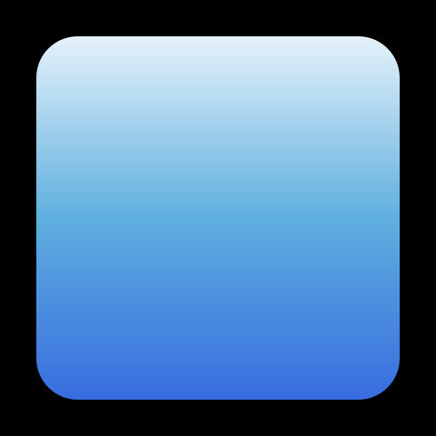
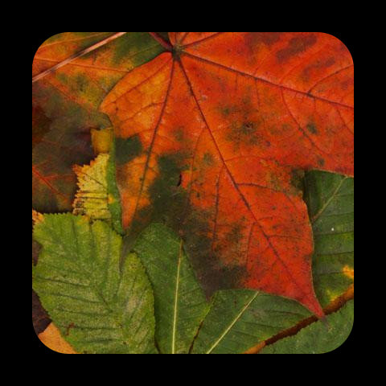
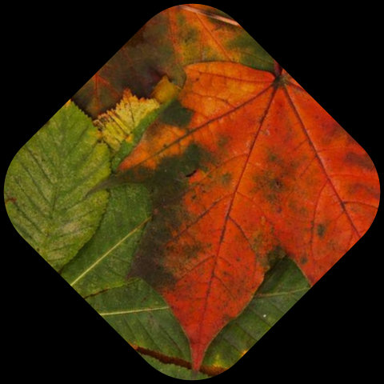
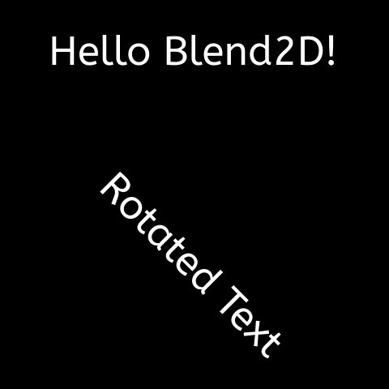
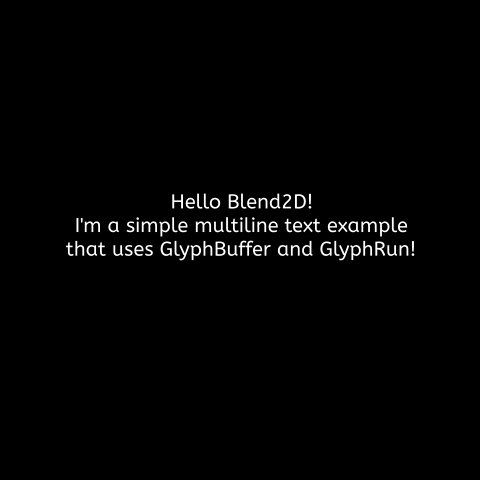

# Getting Started

Let's start with a simple example, taken from the *blGettingStarted01* example project:

### Delphi Source
```Delphi
procedure Run;
begin
  { Use constructor or `Make` method to allocate a new image data of the
    required format. }
  var Image := TBLImage.Create(480, 480, TBLFormat.Prgb32);

  { Attach a rendering context into Image. }
  var Context := TBLContext.Create(Image);

  { Clearing the image would make it transparent. }
  Context.ClearAll;

  { Create a path having cubic curves. }
  var Path: TBLPath;
  Path.MoveTo(26, 31);
  Path.CubicTo(642, 132, 587, -136, 25, 464);
  Path.CubicTo(882, 404, 144, 267, 27, 31);

  { Fill a path with opaque white - $AARRGGBB. }
  Context.FillPath(Path, TAlphaColors.White);

  { Detach the rendering context from `Image`.}
  Context.Finish;

  { Let's use some built-in codecs provided by Blend2D. }
  Image.WriteToFile('blGettingStarted01.png');
end;
```

### Output


If you compile and run the application it should create the image shown above.

!!! note

    As can be seen in the example Blend2D Delphi API uses a `TBL` prefix and uses RAII for all "classes" that require memory management. This design simplifies the use of the API and minimizes the possibility of memory leaks. Instead of Delphi classes, the Delphi API uses [Custom Managed Records](https://docwiki.embarcadero.com/RADStudio/Athens/en/Custom_Managed_Records) as a lightweight alternative that automatically manages memory and other resources, while still being very efficient and lightweight. You can mostly treat these are regular Delphi classes, without having to worry about creating and destroying them. They are created automatically as soon as you declare them, and destroyed automatically as soon as they go out of scope (as the `var Path: TBLPath;` declaration in the example above). Some of these still provide constructors as a convenient way to create an instance with certain parameters (as in `var Context := TBLContext.Create(Image);` in the example above). In the remainder of this document, the term "class" actually refers to a Custom Managed Records, but you can forget about that detail.

## Gradients

Blend2D provides a `TBLGradient` class that can be used to describe the following gradients:

* Linear gradient from `[X0, Y0]` to `[X1, Y1]`.
* Radial gradient having the center at `[CX, CY]`, focal point at `[FX, FY]`, and radius `R`.
* Conical gradient having the center at `[CX, CY]` and angle `A`.

The next example (*blGettingStarted02*) shows how to use create a linear gradient:

### Delphi Source
```Delphi
procedure Run;
begin
  var Image := TBLImage.Create(480, 480, TBLFormat.Prgb32);
  var Context := TBLContext.Create(Image);

  Context.ClearAll;

  var Linear := TBLGradient.Create(
    BLLinearGradientValues(0, 0, 0, 480));

  { Coordinates can be specified now or changed later via TBLGradient accessors. }
  Linear := TBLGradient.Create(BLLinearGradientValues(0, 0, 0, 480));

  { Color stops can be added in any order. }
  Linear.AddStop(0.0, $FFFFFFFF);
  Linear.AddStop(0.5, $FF5FAFDF);
  Linear.AddStop(1.0, $FF2F5FDF);

  { SetFillStyle can be used for both colors and styles. Alternatively, a color
    or style can be passed explicitly to a render function. }
  Context.SetFillStyle(Linear);

  { Rounded rect will be filled with the linear gradient. }
  Context.FillRoundRect(40, 40, 400, 400, 45.5);
  Context.Finish;

  Image.WriteToFile('blGettingStarted02.png');
end;
```

### Output


To make this document shorter we will not demonstrate radial and conical gradients as they will be used in later examples. In addition, the example above used fractional coordinates when calling `FillRoundRect` to show that Blend2D API is not restricted to integers. All functions accept double precision floating point coordinates with few exceptions where integral coordinates are allowed like `FillRect`.

## Patterns

Pattern in Blend2D represents an image, transformation matrix, and other properties like extend mode and filter. A single image can be used by multiple patterns and it's also possible to use only a part of an image as a pattern.

Example *blGettingStarted03*:

### Delphi Source
```Delphi
procedure Run;
begin
  var Image := TBLImage.Create(480, 480, TBLFormat.Prgb32);
  var Context := TBLContext.Create(Image);

  Context.ClearAll;

  { Read an image from file. }
  var Texture: TBLImage;
  Texture.ReadFromFile('Resources/Leaves.jpeg');

  { Create a pattern and use it to fill a rounded-rect.
    By default a repeat extend mode is used, but it can be configured to use
    more extend modes. }
  var Pattern := TBLPattern.Create(Texture);

  Context.FillRoundRect(40, 40, 400, 400, 45.5, Pattern);
  Context.Finish;

  Image.WriteToFile('blGettingStarted03.png');
end;
```

### Output


## Transformations

Transformations can be applied to geometry, images, and styles.

Example *blGettingStarted04*:

### Delphi Source
```Delphi
procedure Run;
begin
  var Image := TBLImage.Create(480, 480, TBLFormat.Prgb32);
  var Context := TBLContext.Create(Image);

  Context.ClearAll;

  { Read an image from file. }
  var Texture: TBLImage;
  Texture.ReadFromFile('Resources/Leaves.jpeg');

  { Rotate by 45 degrees about a point at [240, 240]. }
  Context.Rotate(DegToRad(45), 240, 240);

  { Create a pattern and use it to fill a rounded-rect. }
  var Pattern := TBLPattern.Create(Texture);

  Context.FillRoundRect(50, 50, 380, 380, 80.5, Pattern);
  Context.Finish;

  Image.WriteToFile('blGettingStarted04.png');
end;
```

### Output


The exactly same transformations that can be applied to `TBLContext` can also be applied to paths and styles. It's also possible to use a `TBLMatrix2D` to build a transformation matrix consisting of several consecutive transformations and apply it at once.

## Composition

Blend2D supports all Porter & Duff composition operators and many blending operators that are described in SVG and PDF specifications. These operators can be set via the `TBLContext.CompOp` property.

Example *blGettingStarted05*:

### Delphi Source
```Delphi
procedure Run;
begin
  var Image := TBLImage.Create(480, 480, TBLFormat.Prgb32);
  var Context := TBLContext.Create(Image);

  Context.ClearAll;

  { First shape filled with a radial gradient.
    By default, SrcOver composition is used. }
  var Radial := TBLGradient.Create(
    BLRadialGradientValues(180, 180, 180, 180, 180));
  Radial.AddStop(0.0, $FFFFFFFF);
  Radial.AddStop(1.0, $FFFF6F3F);
  Context.FillCircle(180, 180, 160, Radial);

  { Second shape filled by a linear gradient. }
  var Linear := TBLGradient.Create(
    BLLinearGradientValues(195, 195, 470, 470));
  Linear.AddStop(0.0, $FFFFFFFF);
  Linear.AddStop(1.0, $FF3F9FFF);

  { Use CompOp to change a composition operator. }
  Context.CompOp := TBLCompOp.Difference;
  Context.FillRoundRect(195, 195, 270, 270, 25, Linear);

  Context.Finish;

  Image.WriteToFile('blGettingStarted05.png');
end;
```

### Output


## Stroking

Stroking can be specified through the `TBLStrokeOptions` class or set directly through `TBLContext` API as demonstrated in the example (*blGettingStarted06*) below:

### Delphi Source
```Delphi
procedure Run;
begin
  var Image := TBLImage.Create(480, 480, TBLFormat.Prgb32);
  var Context := TBLContext.Create(Image);

  Context.ClearAll;

  var Linear := TBLGradient.Create(
    BLLinearGradientValues(0, 0, 0, 480));
  Linear.AddStop(0.0, $FFFFFFFF);
  Linear.AddStop(0.5, $FFFF1F7F);
  Linear.AddStop(1.0, $FF1F7FFF);

  var Path: TBLPath;
  Path.MoveTo(119, 49);
  Path.CubicTo(259, 29, 99, 279, 275, 267);
  Path.CubicTo(537, 245, 300, -170, 274, 430);

  { Change stroke options. }
  Context.StrokeWidth := 15;
  Context.StrokeStartCap := TBLStrokeCap.Round;
  Context.StrokeEndCap := TBLStrokeCap.Butt;
  Context.StrokePath(Path, Linear);

  Context.Finish;

  Image.WriteToFile('blGettingStarted06.png');
end;
```

### Output


## Text Rendering

Text rendering was added recently to Blend2D and it's one of the features that would need further improvements. Blend2D provides both low-level and high-level interfaces to render text and the following example (*blGettingStarted07*) shows how to use the high-level one:

### Delphi Source
```Delphi
procedure Run;
begin
  var Image := TBLImage.Create(480, 480, TBLFormat.Prgb32);
  var Context := TBLContext.Create(Image);

  Context.ClearAll;

  var Face: TBLFontFace;
  Face.MakeFromFile('Resources/ABeeZee-Regular.ttf');

  var Font: TBLFont;
  Font.MakeFromFace(Face, 50);

  Context.SetFillStyle($FF000000);
  Context.FillText(BLPoint(60, 80), Font, 'Hello Blend2D!');

  Context.Rotate(0.785398);
  Context.FillText(BLPoint(250, 80), Font, 'Rotated Text');

  Context.Finish;

  Image.WriteToFile('blGettingStarted07.png');
end;
```

### Output


## Glyph Buffer

`TBLGlyphBuffer` is a low-level interface that can be used to convert text to glyphs and to retrieve useful information about them. If you need to position text or calculate text metrics then `TBLGlyphBuffer` is the only way of obtaining such information.

Example *blGettingStarted08*:

### Delphi Source
```Delphi
procedure Run;
const
  TEXTS: array [0..2] of String = (
    'Hello Blend2D!',
    'I''m a simple multiline text example',
    'that uses GlyphBuffer and GlyphRun!');
begin
  var Image := TBLImage.Create(480, 480, TBLFormat.Prgb32);
  var Context := TBLContext.Create(Image);

  var Face: TBLFontFace;
  Face.MakeFromFile('Resources/ABeeZee-Regular.ttf');

  var Font: TBLFont;
  Font.MakeFromFace(Face, 20);

  var GlyphBuffer: TBLGlyphBuffer;
  var TextMetrics: TBLTextMetrics;
  var FontMetrics := Font.Metrics;
  var Y: Double := 190 + FontMetrics.Ascent;

  Context.ClearAll;

  for var I := 0 to Length(TEXTS) - 1 do
  begin
    GlyphBuffer.SetText(TEXTS[I]);
    Font.Shape(GlyphBuffer);
    Font.GetTextMetrics(GlyphBuffer, TextMetrics);

    var X: Double := (TextMetrics.BoundingBox.X1 - TextMetrics.BoundingBox.X0);
    Context.FillGlyphRun(BLPoint((480 - X) / 2, Y), Font,
      GlyphBuffer.GlyphRun, $FF000000);

    Y := Y + FontMetrics.Ascent + FontMetrics.Descent + FontMetrics.LineGap;
  end;

  Context.Finish;

  Image.WriteToFile('blGettingStarted08.png');
end;
```

### Output

