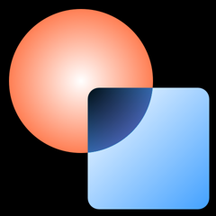

# DelphiBlend2D - Blend2D for Delphi

### Language bindings and framework for Blend2D

[Blend2D](https://blend2d.com/) is high-performance 2D vector graphics engine. It was written from scratch with the goal to achieve the best possible software-based acceleration of 2D rendering. Blend2D provides a high-quality analytic rasterizer, a new stroking engine that uses curve offsetting instead of flattening, and a 2D pipeline generator that uses JIT compilation to generate optimal 2D pipelines at runtime.

DelphiBlend2D opens op Blend2D for Delphi developers. It provides header translations for the [Blend2D C API](https://blend2d.com/doc/group__blend2d__api__c__functions.html), as well as an object oriented framework to make it easier to use.

> Note that Blend2D (and thus DelphiBlend2D) is still in beta. The API and framework is subject to change.

DelphiBlend2D currently supports Windows (32 and 64-bit) and macOS (64-bit). Support for iOS and Android is planned for future versions.

> The Blend2D libraries that are currently used are not fully optimized yet. Although performance is already excellent, expect even better performance once Blend2D goes out of beta.

## Easy to Use API

The DelphiBlend2D OOP framework follows the [Blend2D C++ API](https://blend2d.com/doc/index.html) as closely as possible. It uses interfaces for automatic resource management. The snippet below is taken from the `blGettingStarted05` sample project. 

```Delphi
procedure Run;
var
  Image: IBLImage;
  Context: IBLContext;
  Radial, Linear: IBLGradient;
  Codec: IBLImageCodec;
begin
  Image := TBLImage.Create(480, 480);

  Context := TBLContext.Create(Image);
  Context.CompOp := TBLCompOp.SrcCopy;
  Context.FillAll;

  { First shape filled by a radial gradient. }
  Radial := TBLGradient.Create(BLRadialGradientValues(180, 180, 180, 180, 180));
  Radial.AddStop(0.0, BLRgba32($FFFFFFFF));
  Radial.AddStop(1.0, BLRgba32($FFFF6F3F));

  Context.CompOp := TBLCompOp.SrcOver;
  Context.SetFillStyle(Radial);
  Context.FillCircle(180, 180, 160);

  { Second shape filled by a linear gradient. }
  Linear := TBLGradient.Create(BLLinearGradientValues(195, 195, 470, 470));
  Linear.AddStop(0.0, BLRgba32($FFFFFFFF));
  Linear.AddStop(1.0, BLRgba32($FF3F9FFF));

  Context.CompOp := TBLCompOp.Difference;
  Context.SetFillStyle(Linear);
  Context.FillRoundRect(195, 195, 270, 270, 25);

  Context.Finish;

  Codec := TBLImageCodec.Create;
  if (Codec.FindByName('BMP')) then
    Image.WriteToFile('blGettingStarted05.bmp', Codec);
end;
```

It creates the following output:



## Documentation

Documentation can currently be found as code comments in the `Blend2D.pas` unit. Separate documentation will be provided once Blend2D goes out of beta.

Since the framework matches the original C++ API where possible, you can also use the original [Blend2D documentation](https://blend2d.com/doc/index.html).

## Samples

DelphiBlend2D comes with a variety of sample applications that match the original sample applications of Blend2D:

* The `Samples\GettingStarted` directory contains console applications that use DelphiBlend2D to create images and save them to `.BMP` files. These samples do not use the VCL or FireMonkey framework.
* The `Samples\FireMonkey` directory contains samples that use the FireMonkey framework to provide a simple UI. These match the original Blend2D examples that use the Qt framework. Most of these applications allow you to switch between built-in FireMonkey rendering and Blend2D rendering. Currently, these samples only work on Windows and macOS.

## Planned Features

Features planned for future releases include:

* ~~Provide a `TPaintBox`-like control for VCL and FireMonkey that renders using Blend42 instead.~~
* Provide the possibility to replace the system canvas in FireMonkey applications with a Blend2D canvas. This way, the entire FireMonkey UI will be rendered using Blend2D.

## License

Both Blend2D and DelphiBlend2D are released under the Zlib license. See License.txt for details.

